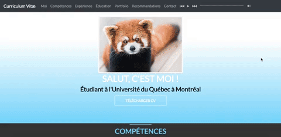

# Projets Udemy

## Description

Répertoire contenant les différents projets de différents cours du site [Udemy](https://www.udemy.com)

## Projets

### Formation Complète Développeur Web

- [Travel Agency](https://github.com/Scylidose/Udemy_projects/tree/master/Travel%20Agency)

Site Web de base pour une agence de voyage, programmé principalement en **HTML** et **CSS**.

- [Snake](https://github.com/Scylidose/Udemy_projects/tree/master/Snake)

Jeu du serpent, programmé principalement en **JavaScript**.

- [Top 5](https://github.com/Scylidose/Udemy_projects/tree/master/Top%205)

Site présentant mes 5 jeux préférés joués sur PS4, programmé principalement en **HTML**, **CSS**, **JavaScript** et **JQuery**.

- [Portfolio](https://github.com/Scylidose/Udemy_projects/tree/master/Portfolio)

Site montrant un template d'un portfolio, programmé principalement en **HTML**, **CSS**, **Bootstrap**, **JavaScript** et **PHP**.

### The Web Developer Bootcamp

- [Gallerie d'images](https://github.com/Scylidose/Udemy_projects/tree/master/Gallery)

Une gallerie de mes photos et des photos que je préfèrent prisent sur No Man's Sky, programmé principalement en **HTML**, **CSS**, **Bootstrap** et **JQuery**.

## À Venir

- Ajout de nouvelles pages, ajout de script pour rendre le site dynamique, ainsi que l'ajout de PHP rendant le formulaire de contact un minimum fonctionnel pour le [Travel Agency](https://github.com/Scylidose/Udemy_projects/tree/master/Travel%20Agency).

- Modification dans le CSS pour un meilleur rendu visuel pour le [Top 5](https://github.com/Scylidose/Udemy_projects/tree/master/Top%205)

-  Ajout d'informations personnelles et corrections minimes pour un affichage optimal pour le [Portfolio](https://github.com/Scylidose/Udemy_projects/tree/master/Portfolio)

- Réalisation de projets pour le cours [The Web Developer Bootcamp](https://www.udemy.com/the-web-developer-bootcamp/learn/v4/overview)

## Références

Les idées de projets viennent principalement de deux cours :
- [Formation Complète Développeur Web](https://www.udemy.com/formation-developpeur-web/learn/v4/overview)

- [The Web Developer Bootcamp](https://www.udemy.com/the-web-developer-bootcamp/learn/v4/overview)