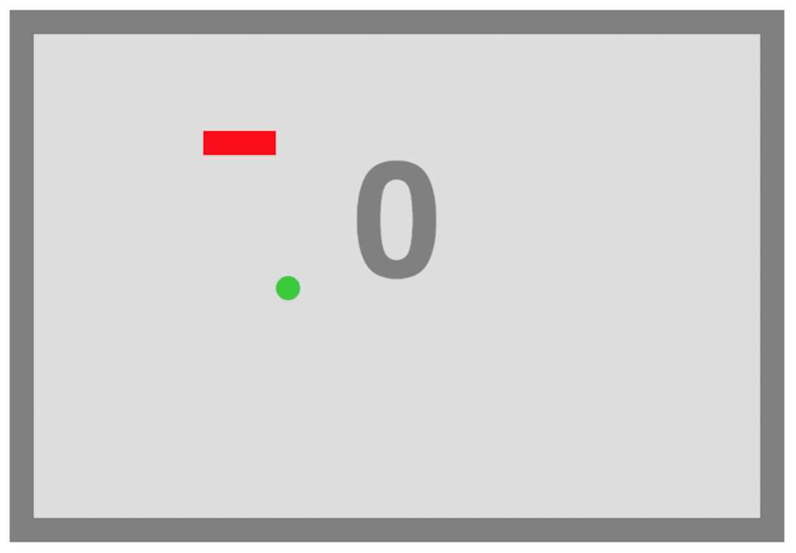
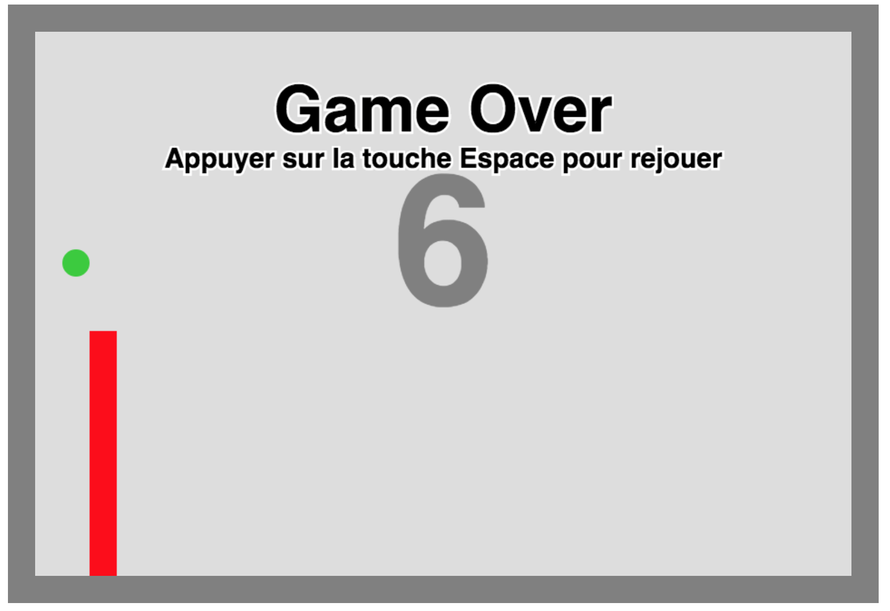

# Le jeu du serpent

## Description

Programme qui permet de jouer au jeu célèbre `Snake`.  
Jeu qui permet d'incarner un serpent qui grandit à chaque fois qu'il mange une pomme,
le jeu se finit lorsque le serpent touche une limite de la plateforme ou lorsque la
tête de ce dernier touche une partie de son corps.

##  Fonctionnement

Pour exécuter le programme, il suffit d'ouvrir le fichier `index.html` sur un navigateur web tel que Google Chrome ou Firefox.  

Vous obtiebdrez alors la fenêtre suivante :

Pour déplacer le serpent dans le cadre, veuillez appuyer  
sur `↑` pour vous diriger vers le haut,  
sur `←` vous diriger vers la gauche,  
sur `→` vous diriger vers la droite,
sur `↓` vous diriger vers le bas.  

Lorsque vous aurez perdu, la fenêtre suivante s'affichera :

Appuer sur `Espace` si vous désirez continuer à jouer.

## Référence

Programme basé sur la démonstration vidéo du cours [Formation Complète Développeur Web](https://www.udemy.com/formation-developpeur-web/learn/v4/overview)

## Auteur

Jordi Saleilles
